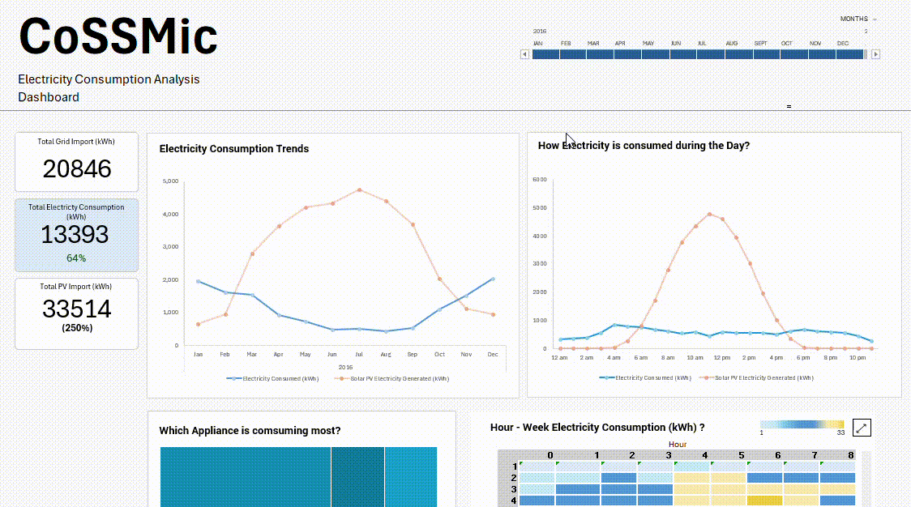

# 📊 CoSSMic Electricity Consumption Analysis
_A dashboard to uncover patterns in household electricity consumption and provide actionable recommendations for sustainable energy use._


---

## 📑 Table of Contents
- [Project Overview](#project-overview)  
- [Key Questions Addressed](#key-questions-addressed)  
- [Key Findings](#key-findings)
- [Recommendations](#recommendations) 
- [Methodology](#methodology)  
- [Skills Showcased](#skills-showcased)  
- [Dataset](#dataset)  
- [Project Structure](#project-structure)  
- [How to Run the Project](#how-to-run-the-project)    
- [Contact Me](#contact-me)

## Project Overview
Household electricity consumption has a direct impact on both cost savings and environmental sustainability. 
This project explores consumption patterns of 11 households in southern Germany across different times of day and seasons to understand usage behavior.   
The goal is to identify opportunities for reducing wastage and optimizing energy efficiency.  

## Key Questions Addressed
1. How is electricity consumed throughout the year and seasons?
2. How is electricity consumed throughout the day?
3. How appliance is used throughout the year and how much power each uses?
4. How much grid power is supplied to these households over time?
5. How is grid power used over time?
6. Can power generated by the solar panel supply the household demand? 

## Key Findings
*These key findings are only based on 2016 electricity consumption*.  
1.  During winter seasons, solar panel electricity generation couldn't hold the required demand but, between summer and mid autumn, solar electricity surpasses the demand by **46%** on average.
2. A huge dip of **66%** electricity consumption occurs between summer and autumn after a **75%** increase from during the winter season.
3. Heat Pumps is rarely used during the summer and autumn season but during the winter season, it dominates by consuming **67% - 72%** of the total electricity.
4. During winter, peak Consumption was observed during **3 am - 4 am** and **5 pm - 6pm** and fairly during stable during the rest of the year.

## Recommendations
1. 
2. 
3. 

## Methodology
1. **Data Cleaning & Preparation (with Power Query)**   
   - Columns relating to industrial areas and public infrastructure were removed.
   - The columns were indexed with **Power Query index creator**.
   - In order to calculate the differential electricity consumption of each appliance, 
   the table was duplicated with an offset index of 1;
   - These tables were merged by the index and each record was substracted from their respective cumulative appliance consumption.
   - Differential electricity consumption was computed by indexing
   - Total appliance electricity consumption from the household was calculated to create five new columns (`refrigerator`, `dishwasher`, `freezer`, `heat pump`, `cooling pump`).
   - Total electricity consumption was calculated. 

2. **Exploratory Data Analysis (EDA with Pivot Tables and Charts)**  
   - Created Pivot tables to show the total electricity against time.
   - Created a Pivot table to show electricity usage throughout the day.
   - Computed the percentage usage of each appliance electricity consumption.
   - Calculated the total solar (PV) electricity generated, grid electricity imports and exports.
   - Calculated the portion of grid import consumed at a specific time.  

3. **Visualization & Dashboards (with Pivot Charts and Sliders)**    
   - Created a time-series line plot of total electricity consumption against time (years, months, quarters).  
   - Created a treemap to show the portion of electricity consumed by each appliance.
   - A single timestamp slider to filter out all the charts and tables.


## Skills Showcased
- Using **Power Query** with the **M language** to load the dataset, compute new fields and remove columns.
- **Pivot tables** with computed measures and formatting to analyse electricity consumption. 
- **Pivot charts** to visualize time series electricity consumption and appliance usage.


*A snapshot of power query steps used to clean the data.*


## Dataset
- **Source**: A time series collected by CoSSMic (Collaborating Smart Solar-powered Microgrids). The dataset can be found [here](https://data.open-power-system-data.org/household_data/).

| Column Name                              | Type      | Format                      | Description |
|-------------------------------------------|-----------|-----------------------------|-------------|
| utc_timestamp                             | datetime  | fmt:%Y-%m-%dT%H%M%SZ        | Start of time period in Coordinated Universal Time |
| cet_cest_timestamp                        | datetime  | fmt:%Y-%m-%dT%H%M%S%z       | Start of time period in Central European (Summer-) Time |
| interpolated                              | string    | —                           | Marker indicating which columns have missing source data and were interpolated |
| DE_KN_residential1_dishwasher             | float     | —                           | Dishwasher energy consumption in a suburban residential building (kWh) |
| DE_KN_residential1_freezer                | float     | —                           | Freezer energy consumption in a suburban residential building (kWh) |
| DE_KN_residential1_grid_import            | float     | —                           | Energy imported from public grid in a suburban residential building (kWh) |
| DE_KN_residential1_heat_pump              | float     | —                           | Heat pump energy consumption in a suburban residential building (kWh) |
| DE_KN_residential1_pv                     | float     | —                           | Total PV energy generation in a suburban residential building (kWh) |
| DE_KN_residential1_washing_machine        | float     | —                           | Washing machine energy consumption in a suburban residential building (kWh) |
| DE_KN_residential2_circulation_pump       | float     | —                           | Circulation pump energy consumption in a suburban residential building (kWh) |
| DE_KN_residential2_dishwasher             | float     | —                           | Dishwasher energy consumption in a suburban residential building (kWh) |
| DE_KN_residential2_freezer                | float     | —                           | Freezer energy consumption in a suburban residential building (kWh) |
| DE_KN_residential2_grid_import            | float     | —                           | Energy imported from public grid in a suburban residential building (kWh) |
| DE_KN_residential2_washing_machine        | float     | —                           | Washing machine energy consumption in a suburban residential building (kWh) |
| DE_KN_residential3_circulation_pump       | float     | —                           | Circulation pump energy consumption in an urban residential building (kWh) |
| DE_KN_residential3_dishwasher             | float     | —                           | Dishwasher energy consumption in an urban residential building (kWh) |
| DE_KN_residential3_freezer                | float     | —                           | Freezer energy consumption in an urban residential building (kWh) |
| DE_KN_residential3_grid_export            | float     | —                           | Energy exported to public grid in an urban residential building (kWh) |
| DE_KN_residential3_grid_import            | float     | —                           | Energy imported from public grid in an urban residential building (kWh) |
| DE_KN_residential3_pv                     | float     | —                           | Total PV energy generation in an urban residential building (kWh) |
| DE_KN_residential3_refrigerator           | float     | —                           | Refrigerator energy consumption in an urban residential building (kWh) |
| DE_KN_residential3_washing_machine        | float     | —                           | Washing machine energy consumption in an urban residential building (kWh) |
| DE_KN_residential4_dishwasher             | float     | —                           | Dishwasher energy consumption in an urban residential building (kWh) |
| DE_KN_residential4_ev                     | float     | —                           | Electric vehicle charging energy in an urban residential building (kWh) |
| DE_KN_residential4_freezer                | float     | —                           | Freezer energy consumption in an urban residential building (kWh) |
| DE_KN_residential4_grid_export            | float     | —                           | Energy exported to public grid in an urban residential building (kWh) |
| DE_KN_residential4_grid_import            | float     | —                           | Energy imported from public grid in an urban residential building (kWh) |
| DE_KN_residential4_heat_pump              | float     | —                           | Heat pump energy consumption in an urban residential building (kWh) |
| DE_KN_residential4_pv                     | float     | —                           | Total PV energy generation in an urban residential building (kWh) |
| DE_KN_residential4_refrigerator           | float     | —                           | Refrigerator energy consumption in an urban residential building (kWh) |
| DE_KN_residential4_washing_machine        | float     | —                           | Washing machine energy consumption in an urban residential building (kWh) |
| DE_KN_residential5_dishwasher             | float     | —                           | Dishwasher energy consumption in an urban apartment (kWh) |
| DE_KN_residential5_grid_import            | float     | —                           | Energy imported from public grid in an urban apartment (kWh) |
| DE_KN_residential5_refrigerator           | float     | —                           | Refrigerator energy consumption in an urban apartment (kWh) |
| DE_KN_residential5_washing_machine        | float     | —                           | Washing machine energy consumption in an urban apartment (kWh) |
| DE_KN_residential6_circulation_pump       | float     | —                           | Circulation pump energy consumption in an urban residential building (kWh) |
| DE_KN_residential6_dishwasher             | float     | —                           | Dishwasher energy consumption in an urban residential building (kWh) |
| DE_KN_residential6_freezer                | float     | —                           | Freezer energy consumption in an urban residential building (kWh) |
| DE_KN_residential6_grid_export            | float     | —                           | Energy exported to public grid in an urban residential building (kWh) |
| DE_KN_residential6_grid_import            | float     | —                           | Energy imported from public grid in an urban residential building (kWh) |
| DE_KN_residential6_pv                     | float     | —                           | Total PV energy generation in an urban residential building (kWh) |
| DE_KN_residential6_washing_machine        | float     | —                           | Washing machine energy consumption in an urban residential building (kWh) |

- **Challenges**:
   - Multiple missing values after the interpolation.
   - Noisy readings and huge gaps from subsequent records.

## Cleaned Table
| **#** | **Column Name**      | **Data Type** | **Description**                                                          |
| ----- | -------------------- | ------------- | ------------------------------------------------------------------------ |
| 1     | Index                | Int64         | Sequential index used for joining and ordering                           |
| 2     | utc_timestamp        | datetime      | Timestamp of the measurement in UTC                                      |
| 3     | hour                 | Int64         | Extracted hour of day (0–23)                                             |
| 4     | week                 | Int64         | ISO week of the year                                                     |
| 5     | freezer_int          | number        | Incremental freezer consumption                                          |
| 6     | grid_export          | number        | Total grid export (aggregated)                                           |
| 7     | refrigerator_int     | number        | Incremental refrigerator consumption                                     |
| 8     | dishwasher_int       | number        | Incremental dishwasher consumption                                       |
| 9     | washing_machine_int  | number        | Incremental washing-machine consumption                                  |
| 10    | heat_pump_int        | number        | Incremental heat-pump consumption                                        |
| 11    | circulation_pump_int | number        | Incremental circulation pump consumption                                 |
| 12    | grid_import_int      | number        | Incremental grid import                                                  |
| 13    | grid_export_int      | number        | Incremental grid export                                                  |
| 14    | pv_int               | number        | Incremental solar PV output                                              |
| 15    | consumption          | number        | Total household energy consumption (sum of major incremental appliances) |

##  Project Structure
```bash
CossMic-Household-Electricity-Consumption/
├── dataset/ # all dataset used for the dashboard
├── assets/ # images for README.md
├── household_electricity.xlsx # Excel file containing the dashboard
└── README.md # Project documentation
```

## How to Run the Project
This project can be downloaded locally in two ways:
1. Clone the repository with git:
   ```powershell
   git clone https://github.com/emma-fosu/CoSSMic-Household-Electricity-Consumption.git
   ```  
   *In order to use this command, you have to get [Git](https://git-scm.com/downloads) installed*
2. Donwloading and unziping from GitHub:
   - Click the green `< > Code` button located above the list of files.
   - In the menu that appears, click Download ZIP.
   - Once the download is complete, extract the contents of the ZIP file to access all the files. 

## Contact Me:

LinkedIn: [www.linkedin.com/in/emma-fosu](www.linkedin.com/in/emma-fosu)

Email: [emmanuel.fosuduffour@gmail.com](mailto:emmanuel.fosuduffour@gmail.com)